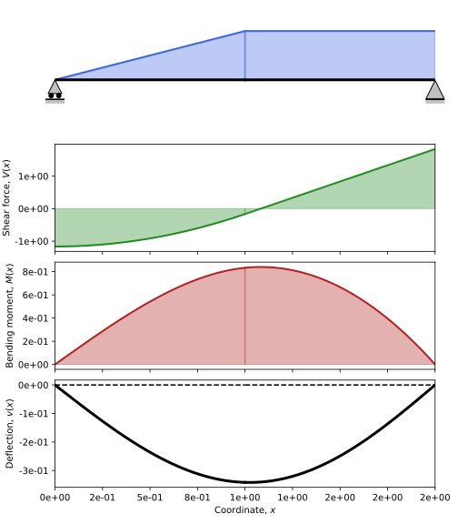
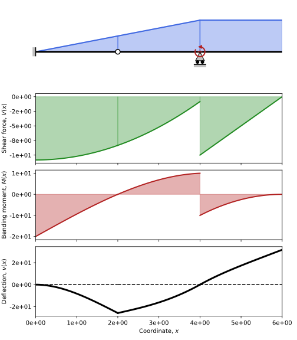
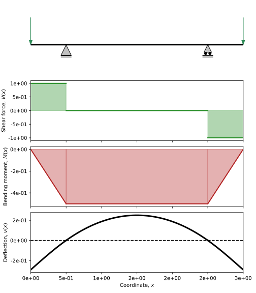
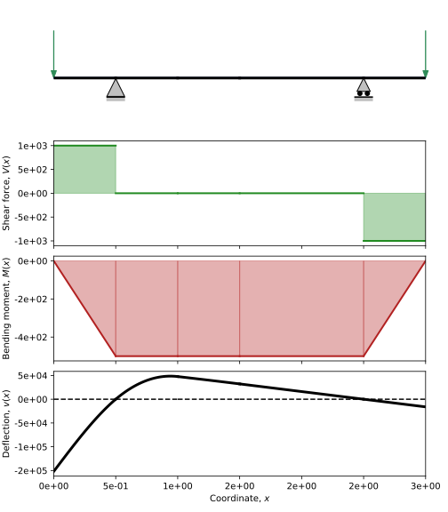
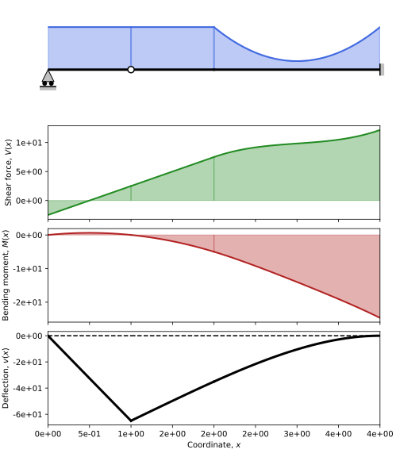
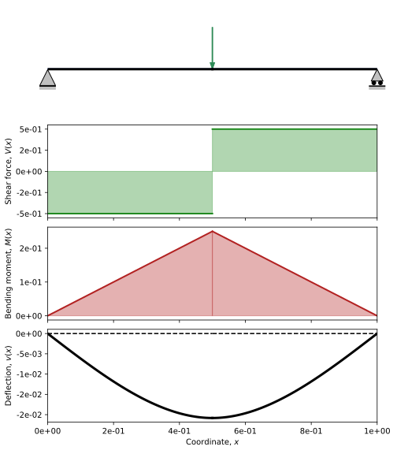
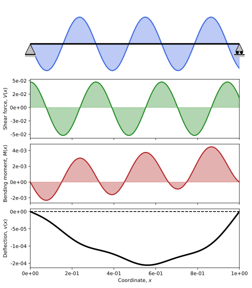

# Examples
Here you can find a comprehensive but by no means exhaustive list of examples exploring the capabilities of SymBeam. In each example, you will find a hyperlink to the associated file in the repository, the respective source code and output: both console and plot.

## [example_1.py](./example_1.py)
1. Symbolic length
2. Roller
3. Pin
4. Symbolic distributed linear load
5. Symbolic distributed constant load

```python
from symbeam import beam


test_beam = beam("l", x0=0)
test_beam.add_support(0, "roller")
test_beam.add_support("l", "pin")
test_beam.add_distributed_load(0, "l/2", "-2 * q / l * x")
test_beam.add_distributed_load("l/2", "l", "-q")
test_beam.solve()
fig, ax = test_beam.plot()
```
<p align="center">
  
</p>

```
                                    Beam points                                    
===================================================================================
     Coordinate              Type                 Load                Moment       
-----------------------------------------------------------------------------------
         0                  Roller                 0                    0          
        l/2            Continuity point            0                    0          
         l              Pinned Support             0                    0          
===================================================================================


                                   Beam segments                                   
===================================================================================
        Span            Young modulus           Inertia          Distributed load  
-----------------------------------------------------------------------------------
 [   0   -  l/2  ]            E                    I                 -2*q*x/l      
 [  l/2  -   l   ]            E                    I                    -q         
===================================================================================


                                Exterior Reactions                                 
===================================================================================
           Point                       Type                        Value           
-----------------------------------------------------------------------------------
             0                         Force                     7*l*q/24          
             l                         Force                     11*l*q/24         
===================================================================================


                                  Internal Loads                                   
===================================================================================
        Span          Diagram                       Expression                    
-----------------------------------------------------------------------------------
 [   0   -  l/2  ]      V(x)                   -7*l*q/24 + q*x**2/l               
 [   0   -  l/2  ]      M(x)                7*l*q*x/24 - q*x**3/(3*l)             
-----------------------------------------------------------------------------------
 [  l/2  -   l   ]      V(x)                     -13*l*q/24 + q*x                 
 [  l/2  -   l   ]      M(x)           -l**2*q/24 + 13*l*q*x/24 - q*x**2/2        
===================================================================================


                              Rotation and deflection                              
===================================================================================
        Span          Variable                      Expression                    
-----------------------------------------------------------------------------------
 [   0   -  l/2  ]      v(x)    -187*l**3*q*x/(5760*E*I) + 7*l*q*x**3/(144*E*I) - q*x**5/(60*E*I*l)
 [   0   -  l/2  ]    dv/dx(x)  -187*l**3*q/(5760*E*I) + 7*l*q*x**2/(48*E*I) - q*x**4/(12*E*I*l)
-----------------------------------------------------------------------------------
 [  l/2  -   l   ]      v(x)    -l**4*q/(1920*E*I) - 157*l**3*q*x/(5760*E*I) - l**2*q*x**2/(48*E*I) + 13*l*q*x**3/(144*E*I) - q*x**4/(24*E*I)
 [  l/2  -   l   ]    dv/dx(x)  -157*l**3*q/(5760*E*I) - l**2*q*x/(24*E*I) + 13*l*q*x**2/(48*E*I) - q*x**3/(6*E*I)
===================================================================================


```
## [example_2.py](./example_2.py)
1. Symbolic length
2. Roller
3. Pin
4. Symbolic distributed linear load
5. Symbolic distributed constant load
6. User-specified symbolic substitutions

```python
from symbeam import beam


test_beam = beam("l", x0=0)
test_beam.add_support(0, "roller")
test_beam.add_support("l", "pin")
test_beam.add_distributed_load(0, "l/2", "-2 * q / l * x")
test_beam.add_distributed_load("l/2", "l", "-q")
test_beam.solve()
fig, ax = test_beam.plot(subs={"q": 2, "l": 2, "x": 10})  # 'x' is not substituted
```
<p align="center">
  
</p>

```
                                    Beam points                                    
===================================================================================
     Coordinate              Type                 Load                Moment       
-----------------------------------------------------------------------------------
         0                  Roller                 0                    0          
        l/2            Continuity point            0                    0          
         l              Pinned Support             0                    0          
===================================================================================


                                   Beam segments                                   
===================================================================================
        Span            Young modulus           Inertia          Distributed load  
-----------------------------------------------------------------------------------
 [   0   -  l/2  ]            E                    I                 -2*q*x/l      
 [  l/2  -   l   ]            E                    I                    -q         
===================================================================================


                                Exterior Reactions                                 
===================================================================================
           Point                       Type                        Value           
-----------------------------------------------------------------------------------
             0                         Force                     7*l*q/24          
             l                         Force                     11*l*q/24         
===================================================================================


                                  Internal Loads                                   
===================================================================================
        Span          Diagram                       Expression                    
-----------------------------------------------------------------------------------
 [   0   -  l/2  ]      V(x)                   -7*l*q/24 + q*x**2/l               
 [   0   -  l/2  ]      M(x)                7*l*q*x/24 - q*x**3/(3*l)             
-----------------------------------------------------------------------------------
 [  l/2  -   l   ]      V(x)                     -13*l*q/24 + q*x                 
 [  l/2  -   l   ]      M(x)           -l**2*q/24 + 13*l*q*x/24 - q*x**2/2        
===================================================================================


                              Rotation and deflection                              
===================================================================================
        Span          Variable                      Expression                    
-----------------------------------------------------------------------------------
 [   0   -  l/2  ]      v(x)    -187*l**3*q*x/(5760*E*I) + 7*l*q*x**3/(144*E*I) - q*x**5/(60*E*I*l)
 [   0   -  l/2  ]    dv/dx(x)  -187*l**3*q/(5760*E*I) + 7*l*q*x**2/(48*E*I) - q*x**4/(12*E*I*l)
-----------------------------------------------------------------------------------
 [  l/2  -   l   ]      v(x)    -l**4*q/(1920*E*I) - 157*l**3*q*x/(5760*E*I) - l**2*q*x**2/(48*E*I) + 13*l*q*x**3/(144*E*I) - q*x**4/(24*E*I)
 [  l/2  -   l   ]    dv/dx(x)  -157*l**3*q/(5760*E*I) - l**2*q*x/(24*E*I) + 13*l*q*x**2/(48*E*I) - q*x**3/(6*E*I)
===================================================================================


```
## [example_3.py](./example_3.py)
1. Symbolic length
2. Fixed
3. Hinge
4. Symbolic distributed constant load
5. Symbolic point load

```python
from symbeam import beam


test_beam = beam("l", x0=0)
test_beam.add_support(0, "fixed")
test_beam.add_support("l/2", "hinge")
test_beam.add_support("l", "roller")
test_beam.add_distributed_load("l/2", "l", "-q")
test_beam.add_point_load("l/4", "-q*l")
test_beam.solve()
fig, ax = test_beam.plot()
```
<p align="center">
  
</p>

```
                                    Beam points                                    
===================================================================================
     Coordinate              Type                 Load                Moment       
-----------------------------------------------------------------------------------
         0                  Fixed                  0                    0          
        l/4            Continuity point           -l*q                  0          
        l/2                 Hinge                  0                    0          
         l                  Roller                 0                    0          
===================================================================================


                                   Beam segments                                   
===================================================================================
        Span            Young modulus           Inertia          Distributed load  
-----------------------------------------------------------------------------------
 [   0   -  l/4  ]            E                    I                    0          
 [  l/4  -  l/2  ]            E                    I                    0          
 [  l/2  -   l   ]            E                    I                    -q         
===================================================================================


                                Exterior Reactions                                 
===================================================================================
           Point                       Type                        Value           
-----------------------------------------------------------------------------------
             0                         Force                      5*l*q/4          
             0                        Moment                    3*l**2*q/8         
             l                         Force                       l*q/4           
===================================================================================


                                  Internal Loads                                   
===================================================================================
        Span          Diagram                       Expression                    
-----------------------------------------------------------------------------------
 [   0   -  l/4  ]      V(x)                         -5*l*q/4                     
 [   0   -  l/4  ]      M(x)                 -3*l**2*q/8 + 5*l*q*x/4              
-----------------------------------------------------------------------------------
 [  l/4  -  l/2  ]      V(x)                          -l*q/4                      
 [  l/4  -  l/2  ]      M(x)                   -l**2*q/8 + l*q*x/4                
-----------------------------------------------------------------------------------
 [  l/2  -   l   ]      V(x)                      -3*l*q/4 + q*x                  
 [  l/2  -   l   ]      M(x)             -l**2*q/4 + 3*l*q*x/4 - q*x**2/2         
===================================================================================


                              Rotation and deflection                              
===================================================================================
        Span          Variable                      Expression                    
-----------------------------------------------------------------------------------
 [   0   -  l/4  ]      v(x)      -3*l**2*q*x**2/(16*E*I) + 5*l*q*x**3/(24*E*I)   
 [   0   -  l/4  ]    dv/dx(x)       -3*l**2*q*x/(8*E*I) + 5*l*q*x**2/(8*E*I)     
-----------------------------------------------------------------------------------
 [  l/4  -  l/2  ]      v(x)    l**4*q/(384*E*I) - l**3*q*x/(32*E*I) - l**2*q*x**2/(16*E*I) + l*q*x**3/(24*E*I)
 [  l/4  -  l/2  ]    dv/dx(x)  -l**3*q/(32*E*I) - l**2*q*x/(8*E*I) + l*q*x**2/(8*E*I)
-----------------------------------------------------------------------------------
 [  l/2  -   l   ]      v(x)    -5*l**4*q/(96*E*I) + 3*l**3*q*x/(32*E*I) - l**2*q*x**2/(8*E*I) + l*q*x**3/(8*E*I) - q*x**4/(24*E*I)
 [  l/2  -   l   ]    dv/dx(x)  3*l**3*q/(32*E*I) - l**2*q*x/(4*E*I) + 3*l*q*x**2/(8*E*I) - q*x**3/(6*E*I)
===================================================================================


```
## [example_4.py](./example_4.py)
1. Numeric length
2. Fixed
3. Hinge
4. Numeric distributed linear load
5. Numeric distributed contstant load
6. Numeric point moment

```python
from symbeam import beam


test_beam = beam(6, x0=0)
test_beam.add_support(0, "fixed")
test_beam.add_support(2, "hinge")
test_beam.add_support(4, "roller")
test_beam.add_distributed_load(0, 4, "-5/4 * x")
test_beam.add_distributed_load(4, 6, -5)
test_beam.add_point_moment(4, 20)
test_beam.solve()
fig, ax = test_beam.plot()
```
<p align="center">
  
</p>

```
                                    Beam points                                    
===================================================================================
     Coordinate              Type                 Load                Moment       
-----------------------------------------------------------------------------------
         0                  Fixed                  0                    0          
         2                  Hinge                  0                    0          
         4                  Roller                 0                    20         
         6             Continuity point            0                    0          
===================================================================================


                                   Beam segments                                   
===================================================================================
        Span            Young modulus           Inertia          Distributed load  
-----------------------------------------------------------------------------------
 [   0   -   2   ]            E                    I                  -5*x/4       
 [   2   -   4   ]            E                    I                  -5*x/4       
 [   4   -   6   ]            E                    I                    -5         
===================================================================================


                                Exterior Reactions                                 
===================================================================================
           Point                       Type                        Value           
-----------------------------------------------------------------------------------
             0                         Force                       65/6            
             0                        Moment                        20             
             4                         Force                       55/6            
===================================================================================


                                  Internal Loads                                   
===================================================================================
        Span          Diagram                       Expression                    
-----------------------------------------------------------------------------------
 [   0   -   2   ]      V(x)                     5*x**2/8 - 65/6                  
 [   0   -   2   ]      M(x)                 -5*x**3/24 + 65*x/6 - 20             
-----------------------------------------------------------------------------------
 [   2   -   4   ]      V(x)                     5*x**2/8 - 65/6                  
 [   2   -   4   ]      M(x)                 -5*x**3/24 + 65*x/6 - 20             
-----------------------------------------------------------------------------------
 [   4   -   6   ]      V(x)                         5*x - 30                     
 [   4   -   6   ]      M(x)                  -5*x**2/2 + 30*x - 90               
===================================================================================


                              Rotation and deflection                              
===================================================================================
        Span          Variable                      Expression                    
-----------------------------------------------------------------------------------
 [   0   -   2   ]      v(x)    -x**5/(96*E*I) + 65*x**3/(36*E*I) - 10*x**2/(E*I) 
 [   0   -   2   ]    dv/dx(x)   -5*x**4/(96*E*I) + 65*x**2/(12*E*I) - 20*x/(E*I) 
-----------------------------------------------------------------------------------
 [   2   -   4   ]      v(x)    -x**5/(96*E*I) + 65*x**3/(36*E*I) - 10*x**2/(E*I) + 248*x/(9*E*I) - 496/(9*E*I)
 [   2   -   4   ]    dv/dx(x)  -5*x**4/(96*E*I) + 65*x**2/(12*E*I) - 20*x/(E*I) + 248/(9*E*I)
-----------------------------------------------------------------------------------
 [   4   -   6   ]      v(x)    -5*x**4/(24*E*I) + 5*x**3/(E*I) - 45*x**2/(E*I) + 1748*x/(9*E*I) - 2912/(9*E*I)
 [   4   -   6   ]    dv/dx(x)  -5*x**3/(6*E*I) + 15*x**2/(E*I) - 90*x/(E*I) + 1748/(9*E*I)
===================================================================================


```
## [example_5.py](./example_5.py)
1. Numeric length
2. Pin
3. Two rollers
4. Numeric distributed constant load
5. Numeric distributed quadratic load

```python
from symbeam import beam


test_beam = beam(6, x0=0)
test_beam.add_support(0, "roller")
test_beam.add_support(2, "roller")
test_beam.add_support(6, "pin")
test_beam.add_support(4, "hinge")
test_beam.add_distributed_load(0, 4, -5)
test_beam.add_distributed_load(4, 6, "-(-3*(x-5)**2 + 8)")
test_beam.solve()
fig, ax = test_beam.plot()
```
<p align="center">
  
</p>

```
                                    Beam points                                    
===================================================================================
     Coordinate              Type                 Load                Moment       
-----------------------------------------------------------------------------------
         0                  Roller                 0                    0          
         2                  Roller                 0                    0          
         4                  Hinge                  0                    0          
         6              Pinned Support             0                    0          
===================================================================================


                                   Beam segments                                   
===================================================================================
        Span            Young modulus           Inertia          Distributed load  
-----------------------------------------------------------------------------------
 [   0   -   2   ]            E                    I                    -5         
 [   2   -   4   ]            E                    I                    -5         
 [   4   -   6   ]            E                    I             3*(x - 5)**2 - 8  
===================================================================================


                                Exterior Reactions                                 
===================================================================================
           Point                       Type                        Value           
-----------------------------------------------------------------------------------
             0                         Force                        -7             
             2                         Force                        34             
             6                         Force                         7             
===================================================================================


                                  Internal Loads                                   
===================================================================================
        Span          Diagram                       Expression                    
-----------------------------------------------------------------------------------
 [   0   -   2   ]      V(x)                         5*x + 7                      
 [   0   -   2   ]      M(x)                     -5*x**2/2 - 7*x                  
-----------------------------------------------------------------------------------
 [   2   -   4   ]      V(x)                         5*x - 27                     
 [   2   -   4   ]      M(x)                  -5*x**2/2 + 27*x - 68               
-----------------------------------------------------------------------------------
 [   4   -   6   ]      V(x)               -x**3 + 15*x**2 - 67*x + 85            
 [   4   -   6   ]      M(x)         x**4/4 - 5*x**3 + 67*x**2/2 - 85*x + 60      
===================================================================================


                              Rotation and deflection                              
===================================================================================
        Span          Variable                      Expression                    
-----------------------------------------------------------------------------------
 [   0   -   2   ]      v(x)     -5*x**4/(24*E*I) - 7*x**3/(6*E*I) + 19*x/(3*E*I) 
 [   0   -   2   ]    dv/dx(x)    -5*x**3/(6*E*I) - 7*x**2/(2*E*I) + 19/(3*E*I)   
-----------------------------------------------------------------------------------
 [   2   -   4   ]      v(x)    -5*x**4/(24*E*I) + 9*x**3/(2*E*I) - 34*x**2/(E*I) + 223*x/(3*E*I) - 136/(3*E*I)
 [   2   -   4   ]    dv/dx(x)  -5*x**3/(6*E*I) + 27*x**2/(2*E*I) - 68*x/(E*I) + 223/(3*E*I)
-----------------------------------------------------------------------------------
 [   4   -   6   ]      v(x)    x**6/(120*E*I) - x**5/(4*E*I) + 67*x**4/(24*E*I) - 85*x**3/(6*E*I) + 30*x**2/(E*I) + 61*x/(3*E*I) - 1024/(5*E*I)
 [   4   -   6   ]    dv/dx(x)  x**5/(20*E*I) - 5*x**4/(4*E*I) + 67*x**3/(6*E*I) - 85*x**2/(2*E*I) + 60*x/(E*I) + 61/(3*E*I)
===================================================================================


```
## [example_6.py](./example_6.py)
1. Numeric length
2. Pin
3. Roller
4. Symbolic point load

```python
from symbeam import beam


test_beam = beam(3, x0=0)
test_beam.add_support(0.5, "pin")
test_beam.add_support(2.5, "roller")
test_beam.add_point_load(0, "-P")
test_beam.add_point_load(3, "-P")
test_beam.solve()
fig, ax = test_beam.plot()
```
<p align="center">
  
</p>

```
                                    Beam points                                    
===================================================================================
     Coordinate              Type                 Load                Moment       
-----------------------------------------------------------------------------------
         0             Continuity point            -P                   0          
        0.5             Pinned Support             0                    0          
        2.5                 Roller                 0                    0          
         3             Continuity point            -P                   0          
===================================================================================


                                   Beam segments                                   
===================================================================================
        Span            Young modulus           Inertia          Distributed load  
-----------------------------------------------------------------------------------
 [   0   -  0.5  ]            E                    I                    0          
 [  0.5  -  2.5  ]            E                    I                    0          
 [  2.5  -   3   ]            E                    I                    0          
===================================================================================


                                Exterior Reactions                                 
===================================================================================
           Point                       Type                        Value           
-----------------------------------------------------------------------------------
            0.5                        Force                         P             
            2.5                        Force                         P             
===================================================================================


                                  Internal Loads                                   
===================================================================================
        Span          Diagram                       Expression                    
-----------------------------------------------------------------------------------
 [   0   -  0.5  ]      V(x)                            P                         
 [   0   -  0.5  ]      M(x)                           -P*x                       
-----------------------------------------------------------------------------------
 [  0.5  -  2.5  ]      V(x)                            0                         
 [  0.5  -  2.5  ]      M(x)                          -0.5*P                      
-----------------------------------------------------------------------------------
 [  2.5  -   3   ]      V(x)                            -P                        
 [  2.5  -   3   ]      M(x)                       P*x - 3.0*P                    
===================================================================================


                              Rotation and deflection                              
===================================================================================
        Span          Variable                      Expression                    
-----------------------------------------------------------------------------------
 [   0   -  0.5  ]      v(x)    -P*x**3/(6*E*I) + 0.625*P*x/(E*I) - 0.291666666666667*P/(E*I)
 [   0   -  0.5  ]    dv/dx(x)           -P*x**2/(2*E*I) + 0.625*P/(E*I)          
-----------------------------------------------------------------------------------
 [  0.5  -  2.5  ]      v(x)    -0.25*P*x**2/(E*I) + 0.75*P*x/(E*I) - 0.3125*P/(E*I)
 [  0.5  -  2.5  ]    dv/dx(x)            -0.5*P*x/(E*I) + 0.75*P/(E*I)           
-----------------------------------------------------------------------------------
 [  2.5  -   3   ]      v(x)    0.166666666666667*P*x**3/(E*I) - 1.5*P*x**2/(E*I) + 3.875*P*x/(E*I) - 2.91666666666667*P/(E*I)
 [  2.5  -   3   ]    dv/dx(x)   0.5*P*x**2/(E*I) - 3.0*P*x/(E*I) + 3.875*P/(E*I) 
===================================================================================


```
## [example_7.py](./example_7.py)
1. Numeric length
2. Pin
3. Rollers
4. Symbolic point load
5. Discontinuous distribution of Young modulus
6. Discontinuous distribution of second moment of area
7. `E` and `I` symbols created with SymPy
8. User-speficied substitution

```python

from symbeam import beam

```
<p align="center">
  
</p>

```
                                    Beam points                                    
===================================================================================
     Coordinate              Type                 Load                Moment       
-----------------------------------------------------------------------------------
         0             Continuity point            -P                   0          
        0.5             Pinned Support             0                    0          
         1             Continuity point            0                    0          
        1.5            Continuity point            0                    0          
        2.5                 Roller                 0                    0          
         3             Continuity point            -P                   0          
===================================================================================


                                   Beam segments                                   
===================================================================================
        Span            Young modulus           Inertia          Distributed load  
-----------------------------------------------------------------------------------
 [   0   -  0.5  ]          E/1000                 I                    0          
 [  0.5  -   1   ]          E/1000                 I                    0          
 [   1   -  1.5  ]          E/1000               100*I                  0          
 [  1.5  -  2.5  ]            E                  100*I                  0          
 [  2.5  -   3   ]            E                  100*I                  0          
===================================================================================


                                Exterior Reactions                                 
===================================================================================
           Point                       Type                        Value           
-----------------------------------------------------------------------------------
            0.5                        Force                         P             
            2.5                        Force                         P             
===================================================================================


                                  Internal Loads                                   
===================================================================================
        Span          Diagram                       Expression                    
-----------------------------------------------------------------------------------
 [   0   -  0.5  ]      V(x)                            P                         
 [   0   -  0.5  ]      M(x)                           -P*x                       
-----------------------------------------------------------------------------------
 [  0.5  -   1   ]      V(x)                            0                         
 [  0.5  -   1   ]      M(x)                          -0.5*P                      
-----------------------------------------------------------------------------------
 [   1   -  1.5  ]      V(x)                            0                         
 [   1   -  1.5  ]      M(x)                          -0.5*P                      
-----------------------------------------------------------------------------------
 [  1.5  -  2.5  ]      V(x)                            0                         
 [  1.5  -  2.5  ]      M(x)                          -0.5*P                      
-----------------------------------------------------------------------------------
 [  2.5  -   3   ]      V(x)                            -P                        
 [  2.5  -   3   ]      M(x)                       P*x - 3.0*P                    
===================================================================================


                              Rotation and deflection                              
===================================================================================
        Span          Variable                      Expression                    
-----------------------------------------------------------------------------------
 [   0   -  0.5  ]      v(x)    -500*P*x**3/(3*E*I) + 345.31375*P*x/(E*I) - 151.823541666667*P/(E*I)
 [   0   -  0.5  ]    dv/dx(x)        -500*P*x**2/(E*I) + 345.31375*P/(E*I)       
-----------------------------------------------------------------------------------
 [  0.5  -   1   ]      v(x)    -250.0*P*x**2/(E*I) + 470.31375*P*x/(E*I) - 172.656875*P/(E*I)
 [  0.5  -   1   ]    dv/dx(x)         -500.0*P*x/(E*I) + 470.31375*P/(E*I)       
-----------------------------------------------------------------------------------
 [   1   -  1.5  ]      v(x)    -2.5*P*x**2/(E*I) - 24.68625*P*x/(E*I) + 74.843125*P/(E*I)
 [   1   -  1.5  ]    dv/dx(x)          -5.0*P*x/(E*I) - 24.68625*P/(E*I)         
-----------------------------------------------------------------------------------
 [  1.5  -  2.5  ]      v(x)    -0.0025*P*x**2/(E*I) - 32.17875*P*x/(E*I) + 80.4625*P/(E*I)
 [  1.5  -  2.5  ]    dv/dx(x)         -0.005*P*x/(E*I) - 32.17875*P/(E*I)        
-----------------------------------------------------------------------------------
 [  2.5  -   3   ]      v(x)    0.00166666666666667*P*x**3/(E*I) - 0.015*P*x**2/(E*I) - 32.1475*P*x/(E*I) + 80.4364583333333*P/(E*I)
 [  2.5  -   3   ]    dv/dx(x)  0.005*P*x**2/(E*I) - 0.03*P*x/(E*I) - 32.1475*P/(E*I)
===================================================================================


```
## [example_8.py](./example_8.py)
1. Numeric length
2. Pin
3. Rollers
4. Symbolic point load
5. Discontinuous distribution of Young modulus
6. Discontinuous distribution of second moment of area
7. `E` and `I` imported directly from SymPy library
8. User-speficied substitution

```python
from sympy.abc import E, I

from symbeam import beam

```
<p align="center">
  
</p>

```
                                    Beam points                                    
===================================================================================
     Coordinate              Type                 Load                Moment       
-----------------------------------------------------------------------------------
         0             Continuity point            -P                   0          
        0.5             Pinned Support             0                    0          
         1             Continuity point            0                    0          
        1.5            Continuity point            0                    0          
        2.5                 Roller                 0                    0          
         3             Continuity point            -P                   0          
===================================================================================


                                   Beam segments                                   
===================================================================================
        Span            Young modulus           Inertia          Distributed load  
-----------------------------------------------------------------------------------
 [   0   -  0.5  ]          E/1000                 I                    0          
 [  0.5  -   1   ]          E/1000                 I                    0          
 [   1   -  1.5  ]          E/1000               100*I                  0          
 [  1.5  -  2.5  ]            E                  100*I                  0          
 [  2.5  -   3   ]            E                  100*I                  0          
===================================================================================


                                Exterior Reactions                                 
===================================================================================
           Point                       Type                        Value           
-----------------------------------------------------------------------------------
            0.5                        Force                         P             
            2.5                        Force                         P             
===================================================================================


                                  Internal Loads                                   
===================================================================================
        Span          Diagram                       Expression                    
-----------------------------------------------------------------------------------
 [   0   -  0.5  ]      V(x)                            P                         
 [   0   -  0.5  ]      M(x)                           -P*x                       
-----------------------------------------------------------------------------------
 [  0.5  -   1   ]      V(x)                            0                         
 [  0.5  -   1   ]      M(x)                          -0.5*P                      
-----------------------------------------------------------------------------------
 [   1   -  1.5  ]      V(x)                            0                         
 [   1   -  1.5  ]      M(x)                          -0.5*P                      
-----------------------------------------------------------------------------------
 [  1.5  -  2.5  ]      V(x)                            0                         
 [  1.5  -  2.5  ]      M(x)                          -0.5*P                      
-----------------------------------------------------------------------------------
 [  2.5  -   3   ]      V(x)                            -P                        
 [  2.5  -   3   ]      M(x)                       P*x - 3.0*P                    
===================================================================================


                              Rotation and deflection                              
===================================================================================
        Span          Variable                      Expression                    
-----------------------------------------------------------------------------------
 [   0   -  0.5  ]      v(x)    -500*P*x**3/(3*E*I) + 345.31375*P*x/(E*I) - 151.823541666667*P/(E*I)
 [   0   -  0.5  ]    dv/dx(x)        -500*P*x**2/(E*I) + 345.31375*P/(E*I)       
-----------------------------------------------------------------------------------
 [  0.5  -   1   ]      v(x)    -250.0*P*x**2/(E*I) + 470.31375*P*x/(E*I) - 172.656875*P/(E*I)
 [  0.5  -   1   ]    dv/dx(x)         -500.0*P*x/(E*I) + 470.31375*P/(E*I)       
-----------------------------------------------------------------------------------
 [   1   -  1.5  ]      v(x)    -2.5*P*x**2/(E*I) - 24.68625*P*x/(E*I) + 74.843125*P/(E*I)
 [   1   -  1.5  ]    dv/dx(x)          -5.0*P*x/(E*I) - 24.68625*P/(E*I)         
-----------------------------------------------------------------------------------
 [  1.5  -  2.5  ]      v(x)    -0.0025*P*x**2/(E*I) - 32.17875*P*x/(E*I) + 80.4625*P/(E*I)
 [  1.5  -  2.5  ]    dv/dx(x)         -0.005*P*x/(E*I) - 32.17875*P/(E*I)        
-----------------------------------------------------------------------------------
 [  2.5  -   3   ]      v(x)    0.00166666666666667*P*x**3/(E*I) - 0.015*P*x**2/(E*I) - 32.1475*P*x/(E*I) + 80.4364583333333*P/(E*I)
 [  2.5  -   3   ]    dv/dx(x)  0.005*P*x**2/(E*I) - 0.03*P*x/(E*I) - 32.1475*P/(E*I)
===================================================================================


```
## [example_9.py](./example_9.py)
1. Numeric length
2. Fixed
3. Hinge
4. Roller
5. Numeric point moment
6. Two numeric distributed linear loads

```python
from symbeam import beam


test_beam = beam(6, x0=0)
test_beam.add_support(0, "fixed")
test_beam.add_support(4, "hinge")
test_beam.add_support(6, "roller")
test_beam.add_point_moment(6, 20)
test_beam.add_distributed_load(0, 2, "-5*x")
test_beam.add_distributed_load(2, 4, "-(20-5*x)")
test_beam.solve()
fig, ax = test_beam.plot()
```
<p align="center">
  
</p>

```
                                    Beam points                                    
===================================================================================
     Coordinate              Type                 Load                Moment       
-----------------------------------------------------------------------------------
         0                  Fixed                  0                    0          
         2             Continuity point            0                    0          
         4                  Hinge                  0                    0          
         6                  Roller                 0                    20         
===================================================================================


                                   Beam segments                                   
===================================================================================
        Span            Young modulus           Inertia          Distributed load  
-----------------------------------------------------------------------------------
 [   0   -   2   ]            E                    I                   -5*x        
 [   2   -   4   ]            E                    I                 5*x - 20      
 [   4   -   6   ]            E                    I                    0          
===================================================================================


                                Exterior Reactions                                 
===================================================================================
           Point                       Type                        Value           
-----------------------------------------------------------------------------------
             0                         Force                        30             
             0                        Moment                        80             
             6                         Force                        -10            
===================================================================================


                                  Internal Loads                                   
===================================================================================
        Span          Diagram                       Expression                    
-----------------------------------------------------------------------------------
 [   0   -   2   ]      V(x)                      5*x**2/2 - 30                   
 [   0   -   2   ]      M(x)                  -5*x**3/6 + 30*x - 80               
-----------------------------------------------------------------------------------
 [   2   -   4   ]      V(x)                  -5*x**2/2 + 20*x - 50               
 [   2   -   4   ]      M(x)            5*x**3/6 - 10*x**2 + 50*x - 280/3         
-----------------------------------------------------------------------------------
 [   4   -   6   ]      V(x)                           -10                        
 [   4   -   6   ]      M(x)                        10*x - 40                     
===================================================================================


                              Rotation and deflection                              
===================================================================================
        Span          Variable                      Expression                    
-----------------------------------------------------------------------------------
 [   0   -   2   ]      v(x)      -x**5/(24*E*I) + 5*x**3/(E*I) - 40*x**2/(E*I)   
 [   0   -   2   ]    dv/dx(x)    -5*x**4/(24*E*I) + 15*x**2/(E*I) - 80*x/(E*I)   
-----------------------------------------------------------------------------------
 [   2   -   4   ]      v(x)    x**5/(24*E*I) - 5*x**4/(6*E*I) + 25*x**3/(3*E*I) - 140*x**2/(3*E*I) + 20*x/(3*E*I) - 8/(3*E*I)
 [   2   -   4   ]    dv/dx(x)  5*x**4/(24*E*I) - 10*x**3/(3*E*I) + 25*x**2/(E*I) - 280*x/(3*E*I) + 20/(3*E*I)
-----------------------------------------------------------------------------------
 [   4   -   6   ]      v(x)    5*x**3/(3*E*I) - 20*x**2/(E*I) + 760*x/(3*E*I) - 1160/(E*I)
 [   4   -   6   ]    dv/dx(x)       5*x**2/(E*I) - 40*x/(E*I) + 760/(3*E*I)      
===================================================================================


```
## [example_10.py](./example_10.py)
1. Numeric length
2. Roller
3. Pin
4. Numeric distriuted linear load
5. Numeric distriuted quadratic load
6. Two numeric distributed linear loads

```python
from symbeam import beam


test_beam = beam(4, x0=0)
test_beam.add_support(2, "roller")
test_beam.add_support(4, "pin")
test_beam.add_distributed_load(0, 2, "-5*x")
test_beam.add_distributed_load(2, 4, "-(4*x**2-24*x+42)")
test_beam.set_inertia(0, 4, 2.051e-5)
test_beam.set_young(0, 4, 210e9)
test_beam.solve()
fig, ax = test_beam.plot()
```
<p align="center">
  
</p>

```
                                    Beam points                                    
===================================================================================
     Coordinate              Type                 Load                Moment       
-----------------------------------------------------------------------------------
         0             Continuity point            0                    0          
         2                  Roller                 0                    0          
         4              Pinned Support             0                    0          
===================================================================================


                                   Beam segments                                   
===================================================================================
        Span            Young modulus           Inertia          Distributed load  
-----------------------------------------------------------------------------------
 [   0   -   2   ]     210000000000.000   2.05100000000000e-5          -5*x        
 [   2   -   4   ]     210000000000.000   2.05100000000000e-5  -4*x**2 + 24*x - 42 
===================================================================================


                                Exterior Reactions                                 
===================================================================================
           Point                       Type                        Value           
-----------------------------------------------------------------------------------
             2                         Force                       62/3            
             4                         Force                         4             
===================================================================================


                                  Internal Loads                                   
===================================================================================
        Span          Diagram                       Expression                    
-----------------------------------------------------------------------------------
 [   0   -   2   ]      V(x)                         5*x**2/2                     
 [   0   -   2   ]      M(x)                        -5*x**3/6                     
-----------------------------------------------------------------------------------
 [   2   -   4   ]      V(x)            4*x**3/3 - 12*x**2 + 42*x - 172/3         
 [   2   -   4   ]      M(x)        -x**4/3 + 4*x**3 - 21*x**2 + 172*x/3 - 64     
===================================================================================


                              Rotation and deflection                              
===================================================================================
        Span          Variable                      Expression                    
-----------------------------------------------------------------------------------
 [   0   -   2   ]      v(x)    -9.6739492156362e-9*x**5 + 1.27954101625482e-6*x - 2.24951565760928e-6
 [   0   -   2   ]    dv/dx(x)    1.27954101625482e-6 - 4.8369746078181e-8*x**4   
-----------------------------------------------------------------------------------
 [   2   -   4   ]      v(x)    -2.57971979083632e-9*x**6 + 4.64349562350538e-8*x**5 - 4.0630586705672e-7*x**4 + 2.21855902011923e-6*x**3 - 7.4295929976086e-6*x**2 + 1.33835862748588e-5*x - 9.61719538023778e-6
 [   2   -   4   ]    dv/dx(x)  -1.54783187450179e-8*x**5 + 2.32174781175269e-7*x**4 - 1.62522346822688e-6*x**3 + 6.6556770603577e-6*x**2 - 1.48591859952172e-5*x + 1.33835862748588e-5
===================================================================================


```
## [example_11.py](./example_11.py)
1. Numeric length
2. Roller
3. Hinge
4. Fixed
5. Numeric distributed constant load
6. Numeric distributed quadratic load

```python
from symbeam import beam


test_beam = beam(4, x0=0)
test_beam.add_support(0, "roller")
test_beam.add_support(1, "hinge")
test_beam.add_support(4, "fixed")
test_beam.add_distributed_load(0, 2, "-5")
test_beam.add_distributed_load(2, 4, "-(4*x**2 - 24 *x + 37)")
test_beam.solve()
fig, ax = test_beam.plot()
```
<p align="center">
  
</p>

```
                                    Beam points                                    
===================================================================================
     Coordinate              Type                 Load                Moment       
-----------------------------------------------------------------------------------
         0                  Roller                 0                    0          
         1                  Hinge                  0                    0          
         2             Continuity point            0                    0          
         4                  Fixed                  0                    0          
===================================================================================


                                   Beam segments                                   
===================================================================================
        Span            Young modulus           Inertia          Distributed load  
-----------------------------------------------------------------------------------
 [   0   -   1   ]            E                    I                    -5         
 [   1   -   2   ]            E                    I                    -5         
 [   2   -   4   ]            E                    I           -4*x**2 + 24*x - 37 
===================================================================================


                                Exterior Reactions                                 
===================================================================================
           Point                       Type                        Value           
-----------------------------------------------------------------------------------
             0                         Force                        5/2            
             4                         Force                       73/6            
             4                        Moment                       -74/3           
===================================================================================


                                  Internal Loads                                   
===================================================================================
        Span          Diagram                       Expression                    
-----------------------------------------------------------------------------------
 [   0   -   1   ]      V(x)                        5*x - 5/2                     
 [   0   -   1   ]      M(x)                    -5*x**2/2 + 5*x/2                 
-----------------------------------------------------------------------------------
 [   1   -   2   ]      V(x)                        5*x - 5/2                     
 [   1   -   2   ]      M(x)                    -5*x**2/2 + 5*x/2                 
-----------------------------------------------------------------------------------
 [   2   -   4   ]      V(x)            4*x**3/3 - 12*x**2 + 37*x - 175/6         
 [   2   -   4   ]      M(x)       -x**4/3 + 4*x**3 - 37*x**2/2 + 175*x/6 - 16    
===================================================================================


                              Rotation and deflection                              
===================================================================================
        Span          Variable                      Expression                    
-----------------------------------------------------------------------------------
 [   0   -   1   ]      v(x)    -5*x**4/(24*E*I) + 5*x**3/(12*E*I) - 2932*x/(45*E*I)
 [   0   -   1   ]    dv/dx(x)   -5*x**3/(6*E*I) + 5*x**2/(4*E*I) - 2932/(45*E*I) 
-----------------------------------------------------------------------------------
 [   1   -   2   ]      v(x)    -5*x**4/(24*E*I) + 5*x**3/(12*E*I) + 452*x/(15*E*I) - 4288/(45*E*I)
 [   1   -   2   ]    dv/dx(x)   -5*x**3/(6*E*I) + 5*x**2/(4*E*I) + 452/(15*E*I)  
-----------------------------------------------------------------------------------
 [   2   -   4   ]      v(x)    -x**6/(90*E*I) + x**5/(5*E*I) - 37*x**4/(24*E*I) + 175*x**3/(36*E*I) - 8*x**2/(E*I) + 188*x/(5*E*I) - 1472/(15*E*I)
 [   2   -   4   ]    dv/dx(x)  -x**5/(15*E*I) + x**4/(E*I) - 37*x**3/(6*E*I) + 175*x**2/(12*E*I) - 16*x/(E*I) + 188/(5*E*I)
===================================================================================


```
## [example_12.py](./example_12.py)
1. Symbolic length
2. Fixed
3. Symbolic point force
4. Classical clamped beam problem

```python
from symbeam import beam


test_beam = beam("L", x0=0)
test_beam.add_support(0, "fixed")
test_beam.add_point_load("L", "-P")
test_beam.solve()
fig, ax = test_beam.plot()
```
<p align="center">
  
</p>

```
                                    Beam points                                    
===================================================================================
     Coordinate              Type                 Load                Moment       
-----------------------------------------------------------------------------------
         0                  Fixed                  0                    0          
         L             Continuity point            -P                   0          
===================================================================================


                                   Beam segments                                   
===================================================================================
        Span            Young modulus           Inertia          Distributed load  
-----------------------------------------------------------------------------------
 [   0   -   L   ]            E                    I                    0          
===================================================================================


                                Exterior Reactions                                 
===================================================================================
           Point                       Type                        Value           
-----------------------------------------------------------------------------------
             0                         Force                         P             
             0                        Moment                        L*P            
===================================================================================


                                  Internal Loads                                   
===================================================================================
        Span          Diagram                       Expression                    
-----------------------------------------------------------------------------------
 [   0   -   L   ]      V(x)                            -P                        
 [   0   -   L   ]      M(x)                        -L*P + P*x                    
===================================================================================


                              Rotation and deflection                              
===================================================================================
        Span          Variable                      Expression                    
-----------------------------------------------------------------------------------
 [   0   -   L   ]      v(x)            -L*P*x**2/(2*E*I) + P*x**3/(6*E*I)        
 [   0   -   L   ]    dv/dx(x)            -L*P*x/(E*I) + P*x**2/(2*E*I)           
===================================================================================


```
## [example_13.py](./example_13.py)
1. Symbolic length
2. Fixed
3. Symbolic point moment
4. Classical clamped beam problem

```python
from symbeam import beam


test_beam = beam("L", x0=0)
test_beam.add_support(0, "fixed")
test_beam.add_point_moment("L", "M")
test_beam.solve()
fig, ax = test_beam.plot()
```
<p align="center">
  
</p>

```
                                    Beam points                                    
===================================================================================
     Coordinate              Type                 Load                Moment       
-----------------------------------------------------------------------------------
         0                  Fixed                  0                    0          
         L             Continuity point            0                    M          
===================================================================================


                                   Beam segments                                   
===================================================================================
        Span            Young modulus           Inertia          Distributed load  
-----------------------------------------------------------------------------------
 [   0   -   L   ]            E                    I                    0          
===================================================================================


                                Exterior Reactions                                 
===================================================================================
           Point                       Type                        Value           
-----------------------------------------------------------------------------------
             0                         Force                         0             
             0                        Moment                        -M             
===================================================================================


                                  Internal Loads                                   
===================================================================================
        Span          Diagram                       Expression                    
-----------------------------------------------------------------------------------
 [   0   -   L   ]      V(x)                            0                         
 [   0   -   L   ]      M(x)                            M                         
===================================================================================


                              Rotation and deflection                              
===================================================================================
        Span          Variable                      Expression                    
-----------------------------------------------------------------------------------
 [   0   -   L   ]      v(x)                      M*x**2/(2*E*I)                  
 [   0   -   L   ]    dv/dx(x)                      M*x/(E*I)                     
===================================================================================


```
## [example_14.py](./example_14.py)
1. Numeric length
2. Pin
3. Roller
4. Numeric point force
5. Classical pinned beam problem with half-span force

```python
from symbeam import beam


test_beam = beam("l", x0=0)
test_beam.add_support(0, "pin")
test_beam.add_support("l", "roller")
test_beam.add_point_load("l/2", "-P")
test_beam.solve()
fig, ax = test_beam.plot()
```
<p align="center">
  
</p>

```
                                    Beam points                                    
===================================================================================
     Coordinate              Type                 Load                Moment       
-----------------------------------------------------------------------------------
         0              Pinned Support             0                    0          
        l/2            Continuity point            -P                   0          
         l                  Roller                 0                    0          
===================================================================================


                                   Beam segments                                   
===================================================================================
        Span            Young modulus           Inertia          Distributed load  
-----------------------------------------------------------------------------------
 [   0   -  l/2  ]            E                    I                    0          
 [  l/2  -   l   ]            E                    I                    0          
===================================================================================


                                Exterior Reactions                                 
===================================================================================
           Point                       Type                        Value           
-----------------------------------------------------------------------------------
             0                         Force                        P/2            
             l                         Force                        P/2            
===================================================================================


                                  Internal Loads                                   
===================================================================================
        Span          Diagram                       Expression                    
-----------------------------------------------------------------------------------
 [   0   -  l/2  ]      V(x)                           -P/2                       
 [   0   -  l/2  ]      M(x)                          P*x/2                       
-----------------------------------------------------------------------------------
 [  l/2  -   l   ]      V(x)                           P/2                        
 [  l/2  -   l   ]      M(x)                      P*l/2 - P*x/2                   
===================================================================================


                              Rotation and deflection                              
===================================================================================
        Span          Variable                      Expression                    
-----------------------------------------------------------------------------------
 [   0   -  l/2  ]      v(x)           -P*l**2*x/(16*E*I) + P*x**3/(12*E*I)       
 [   0   -  l/2  ]    dv/dx(x)          -P*l**2/(16*E*I) + P*x**2/(4*E*I)         
-----------------------------------------------------------------------------------
 [  l/2  -   l   ]      v(x)    P*l**3/(48*E*I) - 3*P*l**2*x/(16*E*I) + P*l*x**2/(4*E*I) - P*x**3/(12*E*I)
 [  l/2  -   l   ]    dv/dx(x)  -3*P*l**2/(16*E*I) + P*l*x/(2*E*I) - P*x**2/(4*E*I)
===================================================================================


```
## [example_15.py](./example_15.py)
1. Numeric length
2. Pin
3. Roller
4. Set of numeric point forces and moments

```python
from symbeam import beam


test_beam = beam("l", x0=0)
test_beam.add_support(0, "pin")
test_beam.add_support("l", "roller")
test_beam.add_point_load("l/4", "P")
test_beam.add_point_moment("l/4", "P*l / 2")
test_beam.add_point_load("l/2", "-2*P")
test_beam.add_point_moment("7*l/8", "-P*l")
test_beam.add_point_load("3*l/4", "-3*P")
test_beam.solve()
fig, ax = test_beam.plot()
```
<p align="center">
  
</p>

```
                                    Beam points                                    
===================================================================================
     Coordinate              Type                 Load                Moment       
-----------------------------------------------------------------------------------
         0              Pinned Support             0                    0          
        l/4            Continuity point            P                  P*l/2        
        l/2            Continuity point           -2*P                  0          
       3*l/4           Continuity point           -3*P                  0          
       7*l/8           Continuity point            0                   -P*l        
         l                  Roller                 0                    0          
===================================================================================


                                   Beam segments                                   
===================================================================================
        Span            Young modulus           Inertia          Distributed load  
-----------------------------------------------------------------------------------
 [   0   -  l/4  ]            E                    I                    0          
 [  l/4  -  l/2  ]            E                    I                    0          
 [  l/2  - 3*l/4 ]            E                    I                    0          
 [ 3*l/4 - 7*l/8 ]            E                    I                    0          
 [ 7*l/8 -   l   ]            E                    I                    0          
===================================================================================


                                Exterior Reactions                                 
===================================================================================
           Point                       Type                        Value           
-----------------------------------------------------------------------------------
             0                         Force                        P/2            
             l                         Force                       7*P/2           
===================================================================================


                                  Internal Loads                                   
===================================================================================
        Span          Diagram                       Expression                    
-----------------------------------------------------------------------------------
 [   0   -  l/4  ]      V(x)                           -P/2                       
 [   0   -  l/4  ]      M(x)                          P*x/2                       
-----------------------------------------------------------------------------------
 [  l/4  -  l/2  ]      V(x)                          -3*P/2                      
 [  l/4  -  l/2  ]      M(x)                    -3*P*l/4 + 3*P*x/2                
-----------------------------------------------------------------------------------
 [  l/2  - 3*l/4 ]      V(x)                           P/2                        
 [  l/2  - 3*l/4 ]      M(x)                      P*l/4 - P*x/2                   
-----------------------------------------------------------------------------------
 [ 3*l/4 - 7*l/8 ]      V(x)                          7*P/2                       
 [ 3*l/4 - 7*l/8 ]      M(x)                    5*P*l/2 - 7*P*x/2                 
-----------------------------------------------------------------------------------
 [ 7*l/8 -   l   ]      V(x)                          7*P/2                       
 [ 7*l/8 -   l   ]      M(x)                    7*P*l/2 - 7*P*x/2                 
===================================================================================


                              Rotation and deflection                              
===================================================================================
        Span          Variable                      Expression                    
-----------------------------------------------------------------------------------
 [   0   -  l/4  ]      v(x)         11*P*l**2*x/(384*E*I) + P*x**3/(12*E*I)      
 [   0   -  l/4  ]    dv/dx(x)         11*P*l**2/(384*E*I) + P*x**2/(4*E*I)       
-----------------------------------------------------------------------------------
 [  l/4  -  l/2  ]      v(x)    -7*P*l**3/(384*E*I) + 71*P*l**2*x/(384*E*I) - 3*P*l*x**2/(8*E*I) + P*x**3/(4*E*I)
 [  l/4  -  l/2  ]    dv/dx(x)  71*P*l**2/(384*E*I) - 3*P*l*x/(4*E*I) + 3*P*x**2/(4*E*I)
-----------------------------------------------------------------------------------
 [  l/2  - 3*l/4 ]      v(x)    3*P*l**3/(128*E*I) - 25*P*l**2*x/(384*E*I) + P*l*x**2/(8*E*I) - P*x**3/(12*E*I)
 [  l/2  - 3*l/4 ]    dv/dx(x)  -25*P*l**2/(384*E*I) + P*l*x/(4*E*I) - P*x**2/(4*E*I)
-----------------------------------------------------------------------------------
 [ 3*l/4 - 7*l/8 ]      v(x)    15*P*l**3/(64*E*I) - 349*P*l**2*x/(384*E*I) + 5*P*l*x**2/(4*E*I) - 7*P*x**3/(12*E*I)
 [ 3*l/4 - 7*l/8 ]    dv/dx(x)  -349*P*l**2/(384*E*I) + 5*P*l*x/(2*E*I) - 7*P*x**2/(4*E*I)
-----------------------------------------------------------------------------------
 [ 7*l/8 -   l   ]      v(x)    79*P*l**3/(128*E*I) - 685*P*l**2*x/(384*E*I) + 7*P*l*x**2/(4*E*I) - 7*P*x**3/(12*E*I)
 [ 7*l/8 -   l   ]    dv/dx(x)  -685*P*l**2/(384*E*I) + 7*P*l*x/(2*E*I) - 7*P*x**2/(4*E*I)
===================================================================================


```
## [example_16.py](./example_16.py)
1. Numeric
2. Pin
3. Roller
4. Numeric sinusoidal distributed force

```python
from symbeam import beam


test_beam = beam(1, x0=0)
test_beam.add_support(0, "pin")
test_beam.add_support(1, "roller")
test_beam.add_distributed_load(0, 1, "sin(20 * x)")
test_beam.solve()
fig, ax = test_beam.plot()
```
<p align="center">
  
</p>

```
                                    Beam points                                    
===================================================================================
     Coordinate              Type                 Load                Moment       
-----------------------------------------------------------------------------------
         0              Pinned Support             0                    0          
         1                  Roller                 0                    0          
===================================================================================


                                   Beam segments                                   
===================================================================================
        Span            Young modulus           Inertia          Distributed load  
-----------------------------------------------------------------------------------
 [   0   -   1   ]            E                    I                sin(20*x)      
===================================================================================


                                Exterior Reactions                                 
===================================================================================
           Point                       Type                        Value           
-----------------------------------------------------------------------------------
             0                         Force                -1/20 + sin(20)/400    
             1                         Force             -sin(20)/400 + cos(20)/20 
===================================================================================


                                  Internal Loads                                   
===================================================================================
        Span          Diagram                       Expression                    
-----------------------------------------------------------------------------------
 [   0   -   1   ]      V(x)                cos(20*x)/20 - sin(20)/400            
 [   0   -   1   ]      M(x)              x*sin(20)/400 - sin(20*x)/400           
===================================================================================


                              Rotation and deflection                              
===================================================================================
        Span          Variable                      Expression                    
-----------------------------------------------------------------------------------
 [   0   -   1   ]      v(x)    -203*x*sin(20)/(480000*E*I) + (x**3*sin(20)/2400 + sin(20*x)/160000)/(E*I)
 [   0   -   1   ]    dv/dx(x)  (x**2*sin(20)/800 + cos(20*x)/8000)/(E*I) - 203*sin(20)/(480000*E*I)
===================================================================================


```
## [example_17.py](./example_17.py)
1. Symbolic length scaled by number
2. Roller
3. Hinge
4. Fixed
4. Symbolic distributed linear load
4. Symbolic distributed quadratic load

```python
from symbeam import beam


test_beam = beam("3*l", x0=0)
test_beam.add_support("l", "roller")
test_beam.add_support("2*l", "hinge")
test_beam.add_support("3*l", "fixed")
test_beam.add_distributed_load(0, "l", "- q / l * x")
test_beam.add_distributed_load("2*l", "3*l", "q / l**2 * x**2 - 6*q*x/l + 9*q")
test_beam.solve()
fig, ax = test_beam.plot()
plt.savefig(__file__.split(".py")[0] + ".svg")
```
<p align="center">
  
</p>

```
                                    Beam points                                    
===================================================================================
     Coordinate              Type                 Load                Moment       
-----------------------------------------------------------------------------------
         0             Continuity point            0                    0          
         l                  Roller                 0                    0          
        2*l                 Hinge                  0                    0          
        3*l                 Fixed                  0                    0          
===================================================================================


                                   Beam segments                                   
===================================================================================
        Span            Young modulus           Inertia          Distributed load  
-----------------------------------------------------------------------------------
 [   0   -   l   ]            E                    I                  -q*x/l       
 [   l   -  2*l  ]            E                    I                    0          
 [  2*l  -  3*l  ]            E                    I           9*q - 6*q*x/l + q*x**2/l**2
===================================================================================


                                Exterior Reactions                                 
===================================================================================
           Point                       Type                        Value           
-----------------------------------------------------------------------------------
             l                         Force                      2*l*q/3          
            3*l                        Force                      -l*q/2           
            3*l                       Moment                    5*l**2*q/12        
===================================================================================


                                  Internal Loads                                   
===================================================================================
        Span          Diagram                       Expression                    
-----------------------------------------------------------------------------------
 [   0   -   l   ]      V(x)                       q*x**2/(2*l)                   
 [   0   -   l   ]      M(x)                      -q*x**3/(6*l)                   
-----------------------------------------------------------------------------------
 [   l   -  2*l  ]      V(x)                          -l*q/6                      
 [   l   -  2*l  ]      M(x)                   -l**2*q/3 + l*q*x/6                
-----------------------------------------------------------------------------------
 [  2*l  -  3*l  ]      V(x)     17*l*q/2 - 9*q*x + 3*q*x**2/l - q*x**3/(3*l**2)  
 [  2*l  -  3*l  ]      M(x)    17*l**2*q/3 - 17*l*q*x/2 + 9*q*x**2/2 - q*x**3/l + q*x**4/(12*l**2)
===================================================================================


                              Rotation and deflection                              
===================================================================================
        Span          Variable                      Expression                    
-----------------------------------------------------------------------------------
 [   0   -   l   ]      v(x)    -13*l**4*q/(60*E*I) + 9*l**3*q*x/(40*E*I) - q*x**5/(120*E*I*l)
 [   0   -   l   ]    dv/dx(x)        9*l**3*q/(40*E*I) - q*x**4/(24*E*I*l)       
-----------------------------------------------------------------------------------
 [   l   -  2*l  ]      v(x)    -53*l**4*q/(180*E*I) + 13*l**3*q*x/(30*E*I) - l**2*q*x**2/(6*E*I) + l*q*x**3/(36*E*I)
 [   l   -  2*l  ]    dv/dx(x)  13*l**3*q/(30*E*I) - l**2*q*x/(3*E*I) + l*q*x**2/(12*E*I)
-----------------------------------------------------------------------------------
 [  2*l  -  3*l  ]      v(x)    33*l**4*q/(20*E*I) - 61*l**3*q*x/(20*E*I) + 17*l**2*q*x**2/(6*E*I) - 17*l*q*x**3/(12*E*I) + 3*q*x**4/(8*E*I) - q*x**5/(20*E*I*l) + q*x**6/(360*E*I*l**2)
 [  2*l  -  3*l  ]    dv/dx(x)  -61*l**3*q/(20*E*I) + 17*l**2*q*x/(3*E*I) - 17*l*q*x**2/(4*E*I) + 3*q*x**3/(2*E*I) - q*x**4/(4*E*I*l) + q*x**5/(60*E*I*l**2)
===================================================================================


```